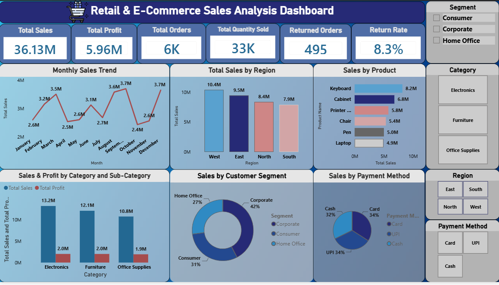

# Retail & E-Commerce Sales Performance Analysis

## 📌 Project Overview

This project analyzes retail and e-commerce sales data using Microsoft Excel and Microsoft Power BI. The objective is to understand sales performance, customer behavior, regional trends, product profitability, and business KPIs through interactive dashboards and data analysis.

---

## 🎯 Objectives

- Analyze sales performance over time.
- Identify top-performing products and categories.
- Evaluate customer segment and regional performance.
- Analyze shipping modes and payment methods.
- Study the impact of discounts and returns.
- Build an interactive Power BI dashboard.
- Generate business insights and recommendations.

---

## ❓ Business Questions

This project answers the following key business questions:

1. How are sales performing over time?
2. Which product categories generate the highest sales and profit?
3. Which sub-categories generate the highest sales and profit?
4. Which products generate the highest sales and profit?
5. Which brands contribute the highest sales and profit?
6. Which customer segments contribute the most sales and profit?
7. Which regions and states perform the best?
8. Which shipping modes are used most frequently, and how do they impact sales?
9. Which payment methods are preferred by customers?
10. How do discounts affect sales and profit?
11. Which products are returned most frequently, and what are the return reasons?
12. What is the overall business performance based on KPIs?

---

## 🛠️ Tools & Technologies

- Microsoft Excel
- Pivot Tables & Pivot Charts
- Power Query
- Microsoft Power BI
- DAX (Data Analysis Expressions)

---

## 📂 Project Files

- Power BI Dashboard (.pbix)
- Cleaned Excel Dataset (.xlsx)
- Project Documentation (PDF)
- Business Questions
- Data Quality Assessment
- Power Query Documentation
- Exploratory Data Analysis (EDA)
- DAX Measures Documentation
- Dashboard Development Documentation
- Business Insights
- Business Recommendations
- Business Storytelling

---

## 📊 Dashboard Features

- KPI Cards
- Monthly Sales Trend
- Category & Sub-Category Analysis
- Sales by Product
- Sales by Region
- Customer Segment Analysis
- Payment Method Analysis
- Interactive Slicers
- Drill-Down Functionality

---

## 📈 Key KPIs

- Total Sales
- Total Profit
- Total Orders
- Total Quantity Sold
- Returned Orders
- Return Rate

---

## 📈 Key Business Outcomes

- Identified monthly sales trends and seasonal sales patterns.
- Determined the highest-performing product categories and sub-categories.
- Compared sales and profit across different regions and customer segments.
- Analyzed customer payment methods and purchasing behavior.
- Evaluated the impact of discounts on sales and profitability.
- Identified product return patterns and major return reasons.
- Built an interactive Power BI dashboard using DAX measures and slicers.
- Generated actionable business insights and recommendations to support decision-making.

---

## 📷 Dashboard Preview

---

## 👨‍💻 Author

**Sai Ganesh**
